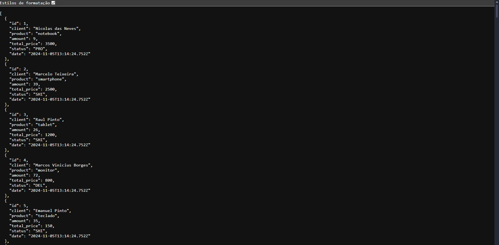

# Gerente de encomendas📦



> Essa API pode ser usada para criar, atualizar, consultar e gerenciar informações sobre encomendas, oferecendo flexibilidade para integração com diferentes plataformas, como aplicativos móveis, sistemas de e-commerce ou dashboards administrativos.

## Requisitos 💻

Antes de clonar o projeto e recomendado você ter os seguintes requisitos:

-   Necessario ter `Python 3+` instalado
-   Requisito `git` para clonar
-   Sua maquina `Windows, Linux ou Mac`.
-   Conhecimento basico `Django e Django Ninja`

## Tecnologias 🚀

As principais tecnologias e ferramentas utilizadas neste projeto são:

-   `Python`: Uma linguagem de programação de alto nível, versátil e amplamente utilizada, conhecida por sua sintaxe simples e legibilidade. Criada por Guido van Rossum em 1991, ela foi projetada com a filosofia de tornar a programação acessível e eficiente, permitindo que os desenvolvedores se concentrem mais na lógica do problema do que nos detalhes técnicos.
-   `Django`: Projetado para facilitar o desenvolvimento de aplicações web robustas, seguras e escaláveis. Ele segue o padrão MVC (Model-View-Controller), embora em Django seja frequentemente chamado de MTV (Model-Template-View), devido à terminologia específica do framework.
-   `Django-Ninja`: Um framework leve e rápido para criar APIs usando o Django. Ele é construído sobre o Pydantic e utiliza os recursos modernos do Python, como type hints, para simplificar o desenvolvimento de APIs REST, com foco em desempenho, simplicidade e produtividade.

## Como instalar 🚀

Windows, Linux e macOS

```
git clone https://github.com/danielBRTanimacao/order-manager-api.git

cd order-manager-api

python -m venv venv
pip install -r requirements.txt
python manage.py makemigrations
python manage.py migrate
python manage.py runserver
```

### Contato 📞

-   Nome: Daniel Tenório
-   Email: danieltenorio2046@gmail.com
-   LinkedIn: [Meu LinkedIn](https://www.linkedin.com/in/daniel-tenório-6471b0244/)
